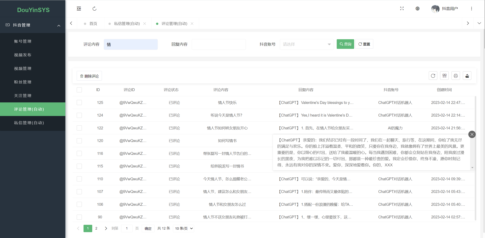
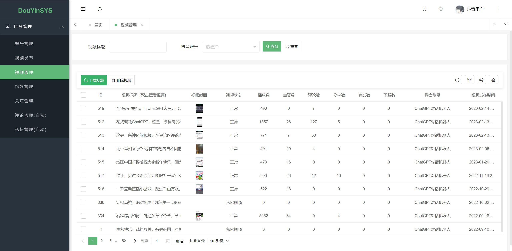

<h1 align="center">欢迎使用&nbsp;&nbsp;抖音ChatGPT对话机器人 👋</h1>

  
  

> 抖音ChatGPT自动对话机器人，抖音评论自动回复，抖音自媒体系统，抖音引流工具

### 🏠 [Homepage](https://github.com/pen9un/douyin-chatgpt-robot)

## 🚀使用方法

使用抖音扫码关注体验（如需了解更多，请抖音私信）：

## 🔮抖音自媒体系统

- 支持抖音账号托管
- 支持抖音视频管理
- 支持去水印下载抖音、火山等平台视频
- 支持评论自动回复管理
- 支持更多等你探索。。。

如需了解更多，请扫上方抖音二维码私信

**评论自动回复管理：**

**抖音视频管理（支持无水印查看下载）：**

## 🤝作者

👤 **pen9un**

* Website: https://github.com/pen9un/
* Github: [@pen9un](https://github.com/pen9un)

## ❤️支持

如果觉得此项目有用，请点一个免费的小 ⭐️⭐️

## ✨Star History

